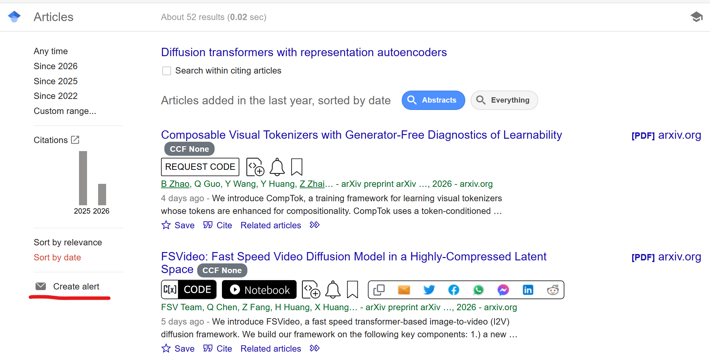
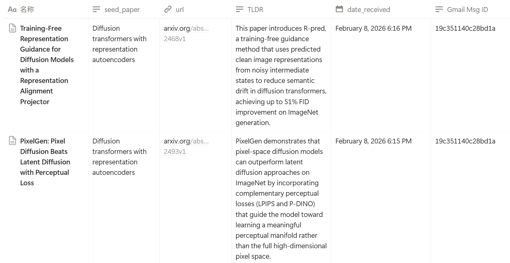
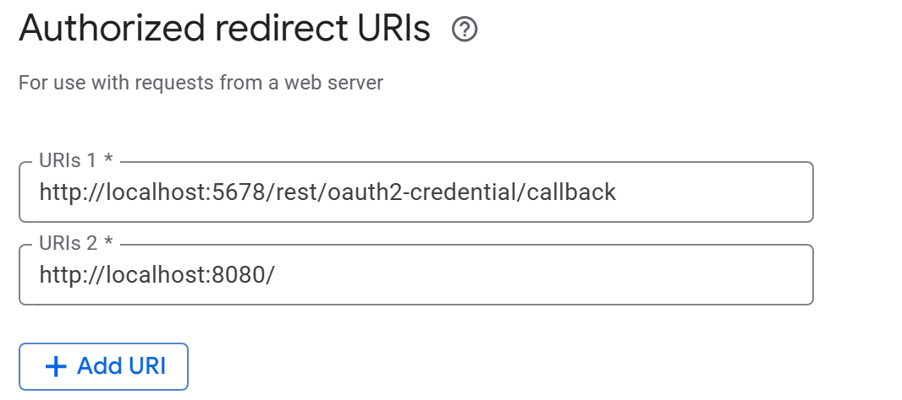

# Paper2Notion - Gmail Alerts Paper to Notion Pipeline

Automatically fetch paper citations from Google Scholar emails, extract all citing papers, generate AI-powered summaries with TLDRs, and add them to your Notion database, providing a more customized track on targeted papers.


**Google Scholar Alert Setting**



**Notion Database Receiving**



## Features

- 📧 **Gmail Integration**: Automatically polls Google Scholar Alert emails
- 📚 **Multi-Paper Extraction**: Extracts all citing papers from each email
- 🤖 **AI Summarization**: Uses LLMs to generate comprehensive paper summaries
- 💡 **Intelligent TLDR**: Generates proper one-sentence summaries
- 📝 **Notion Database**: Automatically adds papers with metadata to your Notion workspace
- ⏰ **Scheduled Processing**: Runs every 6 hours automatically

## Prerequisites

- Python 3.8+
- Google Account with Gmail
- Notion Account
- LLM(e.g. Anthropic opus) API Key

## Installation

### Step 1: Clone the Repository

```bash
git clone https://github.com/851695e35/Paper2Notion.git
cd Paper2Notion
```

### Step 2: Install Dependencies

```bash
pip install -r requirements.txt
```

## Configuration

### Step 1: Gmail Setup (OAuth 2.0)

1. **Create a Google Cloud Project**
   - Go to [Google Cloud Console](https://console.cloud.google.com/)
   - Click "Select a Project" → "New Project"
   - Enter project name: `Paper2Notion`
   - Click "Create"

2. **Enable Gmail API**
   - In the Google Cloud Console, go to "APIs & Services" → "Library"
   - Search for "Gmail API"
   - Click on it and press "Enable"

3. **Create OAuth 2.0 Credentials**
   - Go to "APIs & Services" → "Credentials"
   - Click "Create Credentials" → "OAuth client ID"
   - If prompted, configure the OAuth consent screen first:
     - User Type: External
   - Authorize redirect urls: `http://localhost:8080/` (if on clouds, it should be changed accordingly)
   
   

4. **Download Credentials**
  
   - Go to "APIs & Services" → "OAuth 2.0 Client IDs", click the created instance (Paper2Notion)
   - Click the `add secret` bottom, then download the new secret. 
   - Save the JSON file as `gmail_credentials.json` in the project root

### Step 2: Notion Setup

1. **Create a Notion Integration**
   - Go to [Notion Integrations](https://www.notion.so/my-integrations)
   - Click "New Integration"
   - Name: `Paper2Notion`
   - Click "Submit"
   - Copy the "Internal Integration Token" (you'll need this)
2. **Create a Notion Database**
   - In Notion, create a new database with the following properties:
     - **Name** (Title): Paper title
     - **seed_paper** (Text): The original paper being cited
     - **url** (URL): Link to the paper on arXiv
     - **TLDR** (Text): One-sentence summary
     - **date_received** (Date): When the email was received
     - **Gmail Msg ID** (Text): Gmail message ID for tracking
3. **Share Database with Integration**
   - Go back to your integration page.
   - Choose "Access" Header
   - Choose the page containing the notion database that you want to get access to.
4. **Get Database ID**
   - Open your database in Notion
   - Copy the URL: `https://www.notion.so/[DATABASE_ID]?v=[VIEW_ID]`
   - The `DATABASE_ID` is the long string before the `?`

### Step 3: Anthropic API Setup

1. **Get API Key**
   - Go to [Anthropic Console](https://console.anthropic.com/)
   - Sign up or log in
   - Go to "API Keys"
   - Click "Create Key"
   - Copy your API key

### Step 4: Environment Variables

Create a `.env` file in the project root with your credentials:

```shell
GMAIL_CREDENTIALS_FILE=gmail_credentials.json # download and rename it
GMAIL_TOKEN_FILE=gmail_token.json # automatically generated when logged in
NOTION_API_KEY=your_notion_internal_integration_token # replace with your own
NOTION_DATABASE_ID=your_notion_database_id # replace with your own 
ANTHROPIC_API_KEY=your_anthropic_api_key # replace with your own
GOOGLE_SCHOLAR_SENDER=scholaralerts-noreply@google.com

# write your summary prompt in here.
SUMMARY_PROMPT=Provide a comprehensive summary of this paper including: 1) Main contribution 2) Methodology 3) Key results 4) Significance
```

### Step 5: Gmail Authentication

Run the setup script to authenticate with Gmail:

(tips: for friends inland remember to open TUN mode in your VPN setting.)

```bash
python setup_gmail.py
```

This will automatically:
1. Open a browser window for you to authorize the application
2. Save the OAuth token to `gmail_token.json`

## Running the Application

### Option 1: Run Once

```bash
python main.py
```

This will process all unread Google Scholar emails once and exit.

### Option 2: Run as Scheduled Service (Windows)

Use the provided batch file:

```bash
run_gs2notion.bat
```

This will run the application with automatic 6-hour polling.

### Option 3: Run as Background Service (Linux/Mac)

```bash
nohup python main.py > gs2notion.log 2>&1 &
```

## How It Works

1. **Email Polling**: Checks Gmail every 6 hours for unread emails from Google Scholar
2. **Paper Extraction**: Extracts all citing papers from each email
3. **Content Fetching**: Searches arXiv for each paper's full text or abstract
4. **Summarization**: Uses LLMs to generate comprehensive summaries
5. **TLDR Generation**: Creates intelligent one-sentence summaries
6. **Notion Upload**: Adds papers to your Notion database with all metadata
7. **Email Marking**: Marks processed emails as read

## Notion Database Schema

Your Notion database should have these properties:

| Property | Type | Description |
|----------|------|-------------|
| Name | Title | Paper title (auto-filled) |
| seed_paper | Text | The original paper being cited |
| url | URL | Link to the paper on arXiv |
| TLDR | Text | One-sentence AI-generated summary |
| date_received | Date | When the email was received |
| Gmail Msg ID | Text | Gmail message ID for tracking |


## Todo

+ Markdown formatting issue in notion.
+ Cloud server migration.


## Contact

Feel free to contact if you have any trouble or suggestions for the scripts.

liangyuy001@gmail.com

